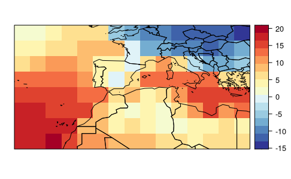

```{r, include = FALSE}
options(java.parameters = "-Xmx16g")
knitr::opts_chunk$set(
  eval = FALSE,
  collapse = TRUE,
  comment = "#>"
)
```

<div class="alert alert-warning" role="alert">This vignettes require climate data from three different sources: TraCE21ka, UERRA, and CMIP5. Please follow `vignette("Data_downloading_and_preprocessing"")` before going on.</div>  

## TraCE21ka data

### Defining region limits for TraCE21ka data

```{r set_trace_limits}
trace.lon <- c(-25, 25)
trace.lat <- c(25, 50)
```

### Loading TraCE21ka data {.tabset} 

To load the TraCE21ka data for the historical period, we use the `dsclim::loadHistoricalTraceGrid` function. This function internally use functions from the `{loadeR}` package. This function require the file (including the path to the file) and the variable name (as it is specified in the data dictionary for standardization). Optionally, the spatial coverage can be controlled, specifying an extent by the longitudinal and latitudinal extents. The function also allow to specify the starting and ending year of the desired period. If not specified, it uses the period 1961 to 1990, both years included.

Once the data are loaded, we used the `transformeR::climatology` function to calculate the average value of the variable for the whole period (e.g. 1961-1990) and the `visualizeR::spatialPlot` to plot the resulting map.

Select a variable:

#### TSMX

```{r load_tsmx}
trace.tsmx <- dsclim::loadHistoricalTraceGrid("Data/TraCE21ka/TSMX/trace.36.400BP-1990CE.cam2.h0.TSMX.2160101-2204012.nc", var="tasmax", lonLim=trace.lon, latLim = trace.lat)

visualizeR::spatialPlot(transformeR::climatology(trace.tsmx), backdrop.theme = "countries", rev.colors=TRUE)
```


#### TSMN

```{r load_tsmn}
trace.tsmn <- dsclim::loadHistoricalTraceGrid("Data/TraCE21ka/TSMN/trace.36.400BP-1990CE.cam2.h0.TSMN.2160101-2204012.nc", var="tasmin", lonLim=trace.lon, latLim = trace.lat)

visualizeR::spatialPlot(transformeR::climatology(trace.tsmn), backdrop.theme = "countries", rev.colors=TRUE)
```




#### TS

```{r load_ts}
trace.ts <- dsclim::loadHistoricalTraceGrid("../../Data/TraCE21ka/TS/trace.36.400BP-1990CE.cam2.h0.TS.2160101-2204012.nc", var="tas", lonLim=trace.lon, latLim = trace.lat)

visualizeR::spatialPlot(transformeR::climatology(trace.ts), backdrop.theme = "countries", rev.colors=TRUE)
```


#### PRECC

```{r load_precc}
trace.precc <- loadHistoricalTraceGrid("Data/TraCE21ka/PRECC/trace.36.400BP-1990CE.cam2.h0.PRECC.2160101-2204012.nc", var="pr", lonLim=trace.lon, latLim = trace.lat)

visualizeR::spatialPlot(transformeR::climatology(trace.precc), backdrop.theme = "countries")
```

#### RELHUM

```{r load_relhum}
trace.relhum <- loadHistoricalTraceGrid("Data/TraCE21ka/RELHUM/trace.36.400BP-1990CE.cam2.h0.RELHUM.2160101-2204012.nc", var="hurs@992.5561", lonLim=trace.lon, latLim = trace.lat)

visualizeR::spatialPlot(transformeR::climatology(trace.relhum), backdrop.theme = "countries")
```

#### CLDTOT

```{r load_cldtot}
trace.cldtot <- loadHistoricalTraceGrid("Data/TraCE21ka/CLDTOT/trace.36.400BP-1990CE.cam2.h0.CLDTOT.2160101-2204012.nc", var="cldtot", lonLim=trace.lon, latLim = trace.lat)

visualizeR::spatialPlot(transformeR::climatology(trace.cldtot), backdrop.theme = "countries")
```

#### PS

```{r load_ps}
trace.ps <- loadHistoricalTraceGrid("Data/TraCE21ka/PS/trace.36.400BP-1990CE.cam2.h0.PS.2160101-2204012.nc", var="ps", lonLim=trace.lon, latLim = trace.lat)

visualizeR::spatialPlot(transformeR::climatology(trace.ps), backdrop.theme = "countries")
```

#### U, V, WSS

```{r load_u}
trace.u <- loadHistoricalTraceGrid("Data/TraCE21ka/U/trace.36.400BP-1990CE.cam2.h0.U.2160101-2204012.nc", var="u@992.5561", lonLim=trace.lon, latLim = trace.lat)

visualizeR::spatialPlot(transformeR::climatology(trace.u), backdrop.theme = "countries")
```

```{r load_v}
trace.v <- loadHistoricalTraceGrid("Data/TraCE21ka/V/trace.36.400BP-1990CE.cam2.h0.V.2160101-2204012.nc", var="v@992.5561", lonLim=trace.lon, latLim = trace.lat)

visualizeR::spatialPlot(transformeR::climatology(trace.v), backdrop.theme = "countries")
```

```{r compute_wss}
trace.wss <- compute_wind_speed(trace.u, trace.v)

visualizeR::spatialPlot(transformeR::climatology(trace.wss), backdrop.theme = "countries")
```


### Make multivariable grid

```{r combine_trace_data}
hist.trace <- makeMultiGrid(trace.tsmx, trace.tsmn, trace.ts, trace.precc, trace.relhum, trace.cldtot, trace.ps, trace.wss)

rm(trace.tsmx, trace.tsmn, trace.ts, trace.precc, trace.relhum, trace.cldtot, trace.ps, trace.wss, trace.u, trace.v)
```

## UERRA historical reanalisis data

Now, we are ready to import the files in R and check them out with the `climate4r` framework. More specifically, we are using the `loadeR` and `visualizeR` packages.

### Defining region limits for UERRA data

```{r set_uerra_limits}
uerra.lon <- c(-11, 12)
uerra.lat <- c(28, 44)
# uerra.lon <- c(-11, 4)
# uerra.lat <- c(36, 44)
```

### Loading TraCE21ka data {.tabset} 

Select a variable 

#### TASMIN

```{r load_tasmin} 
uerra.tasmin <- loadeR::loadGridData("Data/UERRA/UERRA-HARMONIE/2m_temperature/latlon/1961-90_2m_tmin.nc", var = "tasmin", lonLim=uerra.lon, latLim=uerra.lat)

visualizeR::spatialPlot(transformeR::climatology(uerra.tasmin), main="tasmin", backdrop.theme="countries", rev.colors=TRUE, at=seq(-15,40,1))
```

#### TAS

```{r load_tas} 
uerra.tas <- loadeR::loadGridData("Data/UERRA/UERRA-HARMONIE/2m_temperature/latlon/1961-90_2m_temperature.nc", var = "tas", lonLim=uerra.lon, latLim=uerra.lat,  dictionary="Data/UERRA/UERRA_dictionary.dic")

visualizeR::spatialPlot(transformeR::climatology(uerra.tas), main="tas", backdrop.theme="countries", rev.colors=TRUE, at=seq(-15,40,1))
```

#### TASMAX

```{r load_tasmax} 
uerra.tasmax <- loadeR::loadGridData("Data/UERRA/UERRA-HARMONIE/2m_temperature/latlon/1961-90_2m_tmax.nc", var = "tasmax", lonLim=uerra.lon, latLim=uerra.lat)

visualizeR::spatialPlot(transformeR::climatology(uerra.tasmax), main="tasmax", backdrop.theme="countries", rev.colors=TRUE, at=seq(-15,40,1))
```

#### PR

```{r load_pr} 
uerra.pr <- loadeR::loadGridData("Data/UERRA/MESCAN-SURFEX/total_precipitation/latlon/1961-90_total_precipitation.nc", var = "pr", lonLim=uerra.lon, latLim=uerra.lat)

uerra.pr <- transformeR::upscaleGrid(uerra.pr, times=2, aggr.fun=list(FUN=mean))

uerra.pr <- transformeR::interpGrid(uerra.pr, new.coordinates=transformeR::getGrid(uerra.tas), method="bilinear")

visualizeR::spatialPlot(transformeR::climatology(uerra.pr), main="pr", backdrop.theme="countries", at=seq(0,400,25))
```

#### HURS

```{r load_hurs} 
uerra.hurs <- loadeR::loadGridData("Data/UERRA/UERRA-HARMONIE/2m_relative_humidity/latlon/1961-90_2m_relative_humidity.nc", var = "hurs", lonLim=uerra.lon, latLim=uerra.lat)

visualizeR::spatialPlot(transformeR::climatology(uerra.hurs), main="hurs", backdrop.theme="countries", rev.colors=TRUE)
```

#### CLD

```{r load_cld} 
uerra.cld <- loadeR::loadGridData("Data/UERRA/UERRA-HARMONIE/total_cloud_cover/latlon/1961-90_total_cloud_cover.nc", var = "cld", lonLim=uerra.lon, latLim=uerra.lat)

visualizeR::spatialPlot(transformeR::climatology(uerra.cld), main="cld", backdrop.theme="countries", rev.colors=TRUE)
```

#### WSS

```{r load_wss} 
uerra.wss <- loadeR::loadGridData("Data/UERRA/UERRA-HARMONIE/10m_wind_speed/latlon/1961-90_10m_wind_speed.nc", var = "wss", lonLim=uerra.lon, latLim=uerra.lat)

visualizeR::spatialPlot(transformeR::climatology(uerra.wss), main="wss", backdrop.theme="countries", rev.colors=TRUE)
```

### Fix dates 

```{r correct_uerra_dates}
uerra.tasmax <- modifyDates(uerra.tasmax)
uerra.tasmin <- modifyDates(uerra.tasmin)
uerra.tas <- modifyDates(uerra.tas)
uerra.pr <- modifyDates(uerra.pr)
uerra.hurs <- modifyDates(uerra.hurs)
uerra.cld <- modifyDates(uerra.cld)
uerra.wss <- modifyDates(uerra.wss)
```
