```{r, include = FALSE}
# options(java.parameters = "-Xmx16g")
knitr::opts_chunk$set(
  eval = FALSE,
  collapse = TRUE,
  comment = "#>"
)
```

<div class="alert alert-warning" role="alert">This vignettes require climate data from three different sources: TraCE21ka, UERRA, and CMIP5. Please follow `vignette("Data_downloading_and_preprocessing")` before going on.</div>  

## TraCE21ka data

Original TraCE21ka data are in NetCDF format. However, they have several characteristics that makes not straightforward to import them using function from the `{loadeR}` package. Hence, we have developed a set of wrapper functions to import those data into R with the `climate4r` format. More specifically, to load the TraCE21ka data for the historical period, we use the `dsclim::loadHistoricalTraceGrid` function. This function requires the file (including the path to the file) and the variable name (as it is specified in the data dictionary for standardization). Optionally, the spatial coverage can be controlled, specifying an extent by the longitudinal and latitudinal extents. In this tutorial we use the same extent used to create our dsclim data for the Western Mediterranean region. 

```{r set_trace_limits}
library(dsclim) 

trace.lon <- c(-25, 25)
trace.lat <- c(25, 50)
```


### Loading TraCE21ka data {.tabset} 

The function also allow to specify the starting and ending year of the desired period. If not specified, it uses the period 1961 to 1990, both years included.

Once the data are loaded, we used the `transformeR::climatology()` function to calculate the average value of the variable for the whole period (e.g. 1961-1990) and the `visualizeR::spatialPlot()` function to plot the resulting map.

Select a variable:

#### TSMX

```{r load_tsmx_trace}
trace.tsmx <- dsclim::loadHistoricalTraceGrid("../../Data/TraCE21ka/TSMX/trace.36.400BP-1990CE.cam2.h0.TSMX.2160101-2204012.nc", var = "tasmax", lon_lim = trace.lon, lat_lim = trace.lat)

visualizeR::spatialPlot(transformeR::climatology(trace.tsmx), backdrop.theme = "countries", rev.colors = TRUE)
```

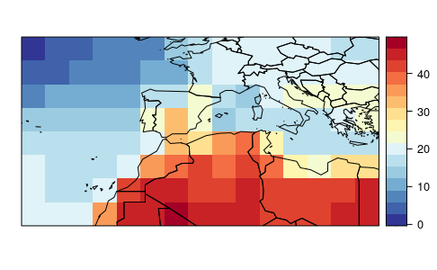

#### TSMN

```{r load_tsmn_trace}
trace.tsmn <- dsclim::loadHistoricalTraceGrid("../../Data/TraCE21ka/TSMN/trace.36.400BP-1990CE.cam2.h0.TSMN.2160101-2204012.nc", var = "tasmin", lon_lim = trace.lon, lat_lim = trace.lat)

visualizeR::spatialPlot(transformeR::climatology(trace.tsmn), backdrop.theme = "countries", rev.colors = TRUE)
```


#### TS

```{r load_ts_trace}
trace.ts <- dsclim::loadHistoricalTraceGrid("Data/TraCE21ka/TS/trace.36.400BP-1990CE.cam2.h0.TS.2160101-2204012.nc", var = "tas", lon_lim = trace.lon, lat_lim = trace.lat)

visualizeR::spatialPlot(transformeR::climatology(trace.ts), backdrop.theme = "countries", rev.colors = TRUE)
```


#### PRECC

```{r load_precc_trace}
trace.precc <- dsclim::loadHistoricalTraceGrid("Data/TraCE21ka/PRECC/trace.36.400BP-1990CE.cam2.h0.PRECC.2160101-2204012.nc", var = "pr", lon_lim = trace.lon, lat_lim = trace.lat)

visualizeR::spatialPlot(transformeR::climatology(trace.precc), backdrop.theme = "countries")
```

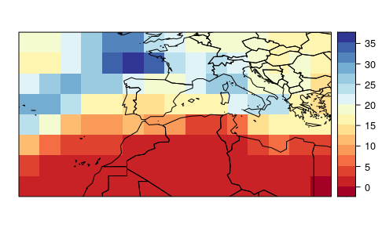

#### RELHUM

```{r load_relhum_trace}
trace.relhum <- dsclim::loadHistoricalTraceGrid("Data/TraCE21ka/RELHUM/trace.36.400BP-1990CE.cam2.h0.RELHUM.2160101-2204012.nc", var = "hurs@992.5561", lon_lim = trace.lon, lat_lim = trace.lat)

visualizeR::spatialPlot(transformeR::climatology(trace.relhum), backdrop.theme = "countries")
```

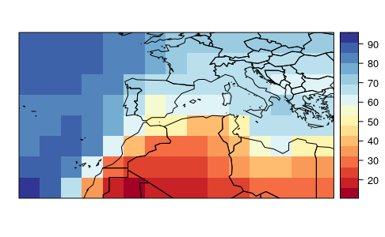

#### CLDTOT

```{r load_cldtot_trace}
trace.cldtot <- dsclim::loadHistoricalTraceGrid("Data/TraCE21ka/CLDTOT/trace.36.400BP-1990CE.cam2.h0.CLDTOT.2160101-2204012.nc", var = "cld", lon_lim = trace.lon, lat_lim = trace.lat)

visualizeR::spatialPlot(transformeR::climatology(trace.cldtot), backdrop.theme = "countries")
```

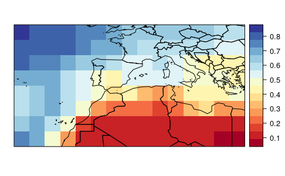

#### PS

```{r load_ps_trace}
trace.ps <- dsclim::loadHistoricalTraceGrid("Data/TraCE21ka/PS/trace.36.400BP-1990CE.cam2.h0.PS.2160101-2204012.nc", var = "ps", lon_lim = trace.lon, lat_lim = trace.lat)

visualizeR::spatialPlot(transformeR::climatology(trace.ps), backdrop.theme = "countries")
```

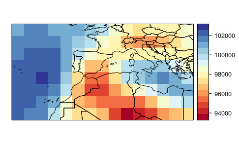

#### U

```{r load_u_trace}
trace.u <- dsclim::loadHistoricalTraceGrid("Data/TraCE21ka/U/trace.36.400BP-1990CE.cam2.h0.U.2160101-2204012.nc", var = "u@992.5561", lon_lim = trace.lon, lat_lim = trace.lat)

visualizeR::spatialPlot(transformeR::climatology(trace.u), backdrop.theme = "countries")
```

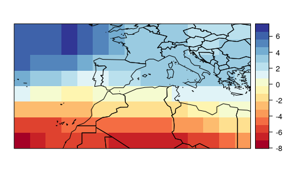

#### V 

```{r load_v_trace}
trace.v <- dsclim::loadHistoricalTraceGrid("Data/TraCE21ka/V/trace.36.400BP-1990CE.cam2.h0.V.2160101-2204012.nc", var = "v@992.5561", lon_lim = trace.lon, lat_lim = trace.lat)

visualizeR::spatialPlot(transformeR::climatology(trace.v), backdrop.theme = "countries")
```

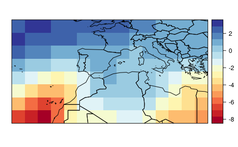

#### WSS

```{r compute_wss_trace}
trace.wss <- dsclim::compute_wind_speed(trace.u, trace.v)

visualizeR::spatialPlot(transformeR::climatology(trace.wss), backdrop.theme = "countries")
```


### Make multivariable grid

The resulting objects can be combined in a multigrid object. This will be required afterwards to use all those variables as predictors in the downscaling process.

```{r combine_trace_data}
hist.trace <- transformeR::makeMultiGrid(trace.tsmx, trace.tsmn, trace.ts, trace.precc, trace.relhum, trace.cldtot, trace.ps, trace.wss)

rm(trace.tsmx, trace.tsmn, trace.ts, trace.precc, trace.relhum, trace.cldtot, trace.ps, trace.wss, trace.u, trace.v)

visualizeR::spatialPlot(transformeR::climatology(hist.trace), backdrop.theme = "countries")
```


## UERRA historical reanalisis data

The UERRA dataset were transformed after downloading to reproject them (see code in the vignette `vignette("Data_downloading_and_preprocessing")`). As result of such transformation, we obtained NetCDF files that can be directly imported in R using the `loadGridData` from the {loadeR} package. This function also allow to specify a geographical region to subset the loaded data.

### Defining region limits for UERRA data

```{r set_uerra_limits}
uerra.lon <- c(-11, 12)
uerra.lat <- c(28, 44)
```


### Loading UERRA data {.tabset} 

Now, we load the tailored data of the UERRA dataset for the period 1961-1990. More specifically, we loaded the same variables that we were interested to downscale. These grid objects were used as predictands in the downscale process.

Select a variable 

#### TASMIN

```{r load_tasmin_uerra} 
uerra.tasmin <- loadeR::loadGridData("Data/UERRA/UERRA-HARMONIE/2m_temperature/latlon/1961-90_2m_tmin.nc", var = "tasmin", lon_lim = uerra.lon, lat_lim = uerra.lat, dictionary = "Data/UERRA/UERRA_dictionary.dic")

visualizeR::spatialPlot(transformeR::climatology(uerra.tasmin), main = "tasmin", backdrop.theme = "countries", rev.colors = TRUE, at = seq(-15, 40, 1))
```

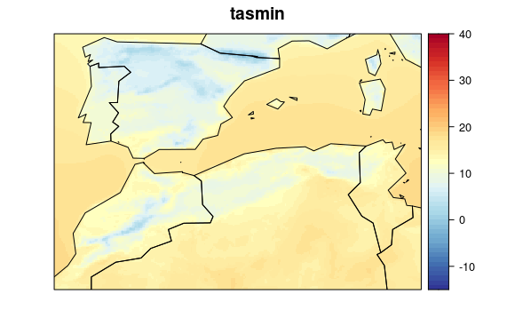

#### TAS

```{r load_tas_uerra} 
uerra.tas <- loadeR::loadGridData("Data/UERRA/UERRA-HARMONIE/2m_temperature/latlon/1961-90_2m_temperature.nc", var = "tas", lon_lim = uerra.lon, lat_lim = uerra.lat, dictionary = "Data/UERRA/UERRA_dictionary.dic")

visualizeR::spatialPlot(transformeR::climatology(uerra.tas), main = "tas", backdrop.theme = "countries", rev.colors = TRUE, at = seq(-15, 40, 1))
```


#### TASMAX

```{r load_tasmax_uerra} 
uerra.tasmax <- loadeR::loadGridData("Data/UERRA/UERRA-HARMONIE/2m_temperature/latlon/1961-90_2m_tmax.nc", var = "tasmax", lon_lim = uerra.lon, lat_lim = uerra.lat, dictionary = "Data/UERRA/UERRA_dictionary.dic")

visualizeR::spatialPlot(transformeR::climatology(uerra.tasmax), main = "tasmax", backdrop.theme = "countries", rev.colors = TRUE, at = seq(-15, 40, 1))
```

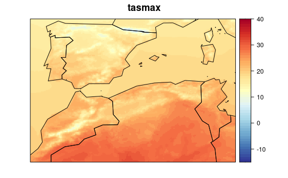


#### PR

```{r load_pr_uerra} 
uerra.pr <- loadeR::loadGridData("Data/UERRA/MESCAN-SURFEX/total_precipitation/latlon/1961-90_total_precipitation.nc", var = "pr", lon_lim = uerra.lon, lat_lim = uerra.lat, dictionary = "Data/UERRA/UERRA_dictionary.dic")

uerra.pr <- transformeR::upscaleGrid(uerra.pr, times = 2, aggr.fun = list(FUN = mean))

uerra.pr <- transformeR::interpGrid(uerra.pr, new.coordinates = transformeR::getGrid(uerra.tas), method = "bilinear")

visualizeR::spatialPlot(transformeR::climatology(uerra.pr), main = "pr", backdrop.theme = "countries", at = seq(0, 400, 25))
```

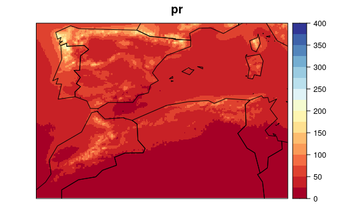 

#### HURS

```{r load_hurs_uerra} 
uerra.hurs <- loadeR::loadGridData("Data/UERRA/UERRA-HARMONIE/2m_relative_humidity/latlon/1961-90_2m_relative_humidity.nc", var = "hurs", lon_lim = uerra.lon, lat_lim = uerra.lat, dictionary = "Data/UERRA/UERRA_dictionary.dic")

visualizeR::spatialPlot(transformeR::climatology(uerra.hurs), main = "hurs", backdrop.theme = "countries", rev.colors = TRUE)
```

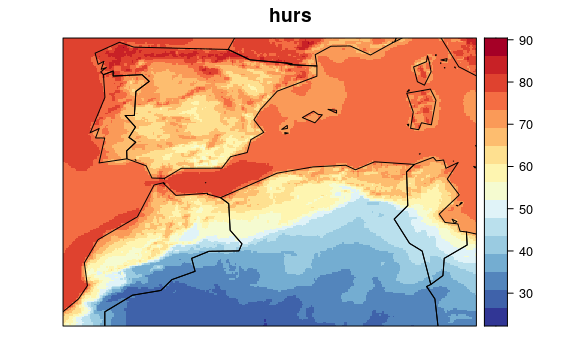 


#### PS

```{r load_ps_uerra} 
uerra.ps <- loadeR::loadGridData("Data/UERRA/UERRA-HARMONIE/surface_pressure/latlon/1961-90_surface_pressure.nc", var = "ps", lon_lim = uerra.lon, lat_lim = uerra.lat, dictionary = "Data/UERRA/UERRA_dictionary.dic")

visualizeR::spatialPlot(transformeR::climatology(uerra.ps), main = "ps", backdrop.theme = "countries", rev.colors = TRUE)
```

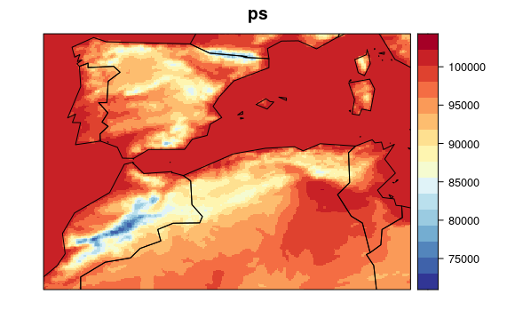 

#### CLD

```{r load_cld_uerra} 
uerra.cld <- loadeR::loadGridData("Data/UERRA/UERRA-HARMONIE/total_cloud_cover/latlon/1961-90_total_cloud_cover.nc", var = "cld", lon_lim = uerra.lon, lat_lim = uerra.lat, dictionary = "Data/UERRA/UERRA_dictionary.dic")

visualizeR::spatialPlot(transformeR::climatology(uerra.cld), main = "cld", backdrop.theme = "countries", rev.colors = TRUE)
```

 


#### WSS

```{r load_wss_uerra} 
uerra.wss <- loadeR::loadGridData("Data/UERRA/UERRA-HARMONIE/10m_wind_speed/latlon/1961-90_10m_wind_speed.nc", var = "wss", lon_lim = uerra.lon, lat_lim = uerra.lat, dictionary = "Data/UERRA/UERRA_dictionary.dic")

visualizeR::spatialPlot(transformeR::climatology(uerra.wss), main = "wss", backdrop.theme = "countries", rev.colors = TRUE)
```

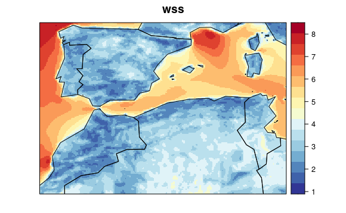 

### Fix dates 

Dates from the UERRA files match the actual year and month, but are interpreted as the central date of the month, rather than the whole range of data. The `modifyDates` function from the `{dsclim}` package modify the dates and fix this small issue.

```{r correct_uerra_dates}
uerra.tasmax <- modifyDates(uerra.tasmax)
uerra.tasmin <- modifyDates(uerra.tasmin)
uerra.tas <- modifyDates(uerra.tas)
uerra.pr <- modifyDates(uerra.pr)
uerra.hurs <- modifyDates(uerra.hurs)
uerra.cld <- modifyDates(uerra.cld)
uerra.wss <- modifyDates(uerra.wss)
```


## CMIP5 future data

CMIP5 data can be directly loaded with the `loadGridData` from the `{loadeR}` package. Here, we used the same extent than for TraCE21ka dataset. For this example, we are going to use the data set from the rcp2.6 and CESM1-CAM5 combination of representative concentration pathways and general circulation model.

```{r set_cmip5_limits}
cmip5.lon <- c(-11.25, 12.50)
cmip5.lat <- c(27, 45)
```

### Loading CMIP5 data {.tabset} 

Select a variable 

#### TASMIN

```{r load_tasmin_cmip} 
cmip.tasmin <- loadeR::loadGridData("Data/CMIP5/rcp2.6/CESM1-CAM5_RCP_2_6/tasmin_Amon_CESM1-CAM5_rcp26_r1i1p1_200601-210012.nc", var = "tasmin", lon_lim = cmip5.lon, lat_lim = cmip5.lat, dictionary = "Data/CMIP5/CMIP5_dictionary.dic")

visualizeR::spatialPlot(transformeR::climatology(cmip.tasmin), main = "tasmin", backdrop.theme = "countries", rev.colors = TRUE, at = seq(-15, 40, 1))
```

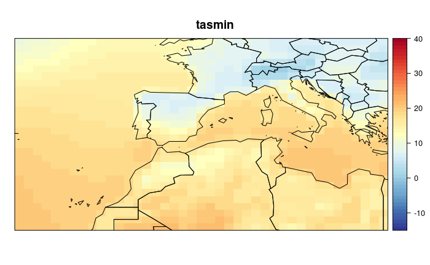

#### TAS

```{r load_tas_cmip} 
cmip.tas <- loadeR::loadGridData("Data/CMIP5/rcp2.6/CESM1-CAM5_RCP_2_6/tasmax_Amon_CESM1-CAM5_rcp26_r1i1p1_200601-210012.nc", var = "tas", lon_lim = cmip5.lon, lat_lim = cmip5.lat, dictionary = "Data/CMIP5/CMIP5_dictionary.dic")

visualizeR::spatialPlot(transformeR::climatology(cmip.tas), main = "tas", backdrop.theme = "countries", rev.colors = TRUE, at = seq(-15, 40, 1))
```
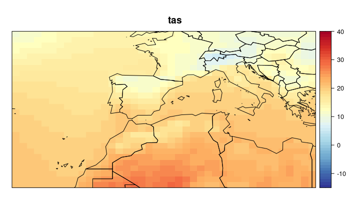

#### TASMAX

```{r load_tasmax_cmip} 
cmip.tasmax <- loadeR::loadGridData("Data/CMIP5/rcp2.6/CESM1-CAM5_RCP_2_6/tasmax_Amon_CESM1-CAM5_rcp26_r1i1p1_200601-210012.nc", var = "tasmax", lon_lim = cmip5.lon, lat_lim = cmip5.lat, dictionary = "Data/CMIP5/CMIP5_dictionary.dic")

visualizeR::spatialPlot(transformeR::climatology(cmip.tasmax), main = "tasmax", backdrop.theme = "countries", rev.colors = TRUE, at = seq(-15, 40, 1))
```

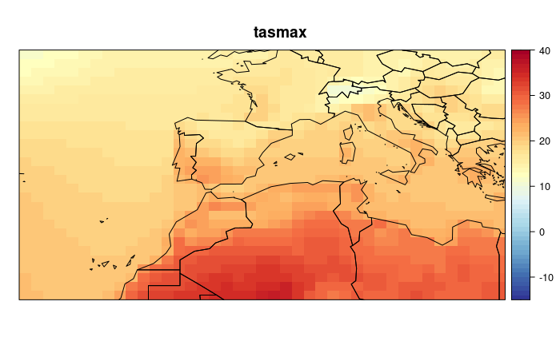


#### PR

```{r load_pr_cmip} 
cmip.pr <- loadeR::loadGridData("Data/CMIP5/rcp2.6/CESM1-CAM5_RCP_2_6/pr_Amon_CESM1-CAM5_rcp26_r1i1p1_200601-210012.nc", var = "pr", lon_lim = cmip5.lon, lat_lim = cmip5.lat, dictionary = "Data/CMIP5/CMIP5_dictionary.dic")

cmip.pr <- transformeR::upscaleGrid(cmip.pr, times = 2, aggr.fun = list(FUN = mean))

cmip.pr <- transformeR::interpGrid(cmip.pr, new.coordinates = transformeR::getGrid(cmip.tas), method = "bilinear")

visualizeR::spatialPlot(transformeR::climatology(cmip.pr), main = "pr", backdrop.theme = "countries", at = seq(0, 400, 25))
```

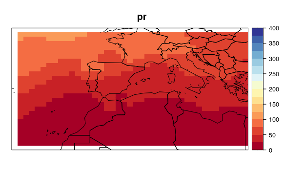 

#### HURS

```{r load_hurs_cmip} 
cmip.hurs <- loadeR::loadGridData("Data/CMIP5/rcp2.6/CESM1-CAM5_RCP_2_6/hurs_Amon_CESM1-CAM5_rcp26_r1i1p1_200601-210012.nc", var = "hurs", lon_lim = cmip5.lon, lat_lim = cmip5.lat, dictionary = "Data/CMIP5/CMIP5_dictionary.dic")

visualizeR::spatialPlot(transformeR::climatology(cmip.hurs), main = "hurs", backdrop.theme = "countries", rev.colors = TRUE)
```

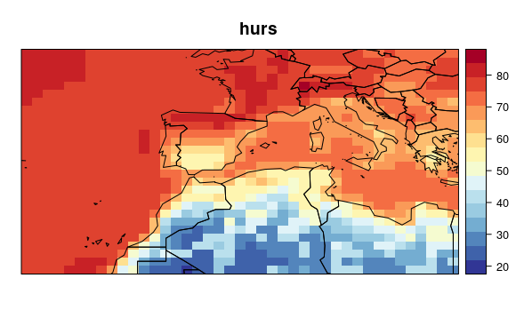 


#### PS

```{r load_ps_cmip} 
cmip.ps <- loadeR::loadGridData("Data/CMIP5/rcp2.6/CESM1-CAM5_RCP_2_6/ps_Amon_CESM1-CAM5_rcp26_r1i1p1_200601-210012.nc", var = "ps", lon_lim = cmip5.lon, lat_lim = cmip5.lat, dictionary = "Data/CMIP5/CMIP5_dictionary.dic")

visualizeR::spatialPlot(transformeR::climatology(cmip.ps), main = "ps", backdrop.theme = "countries", rev.colors = TRUE)
```

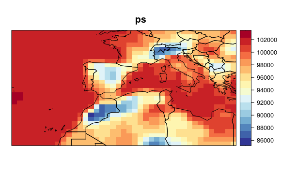 

#### CLD

```{r load_cld_cmip} 
cmip.cld <- loadeR::loadGridData("Data/CMIP5/rcp2.6/CESM1-CAM5_RCP_2_6/clt_Amon_CESM1-CAM5_rcp26_r1i1p1_200601-210012.nc", var = "cld", lon_lim = cmip5.lon, lat_lim = cmip5.lat, dictionary = "Data/CMIP5/CMIP5_dictionary.dic")

visualizeR::spatialPlot(transformeR::climatology(cmip.cld), main = "cld", backdrop.theme = "countries", rev.colors = TRUE)
```

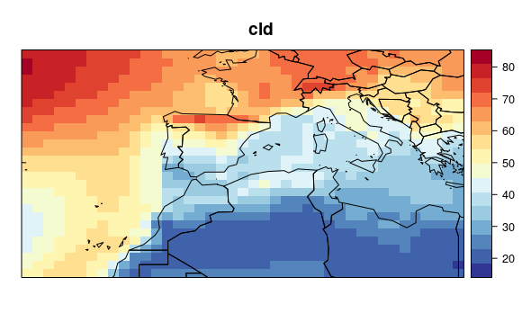 


#### WSS

```{r load_wss_cmip} 
cmip.wss <- loadeR::loadGridData("Data/CMIP5/rcp2.6/CESM1-CAM5_RCP_2_6/sfcWind_Amon_CESM1-CAM5_rcp26_r1i1p1_200601-210012.nc", var = "wss", lon_lim = cmip5.lon, lat_lim = cmip5.lat, dictionary = "Data/CMIP5/CMIP5_dictionary.dic")

visualizeR::spatialPlot(transformeR::climatology(cmip.wss), main = "wss", backdrop.theme = "countries", rev.colors = TRUE)
```

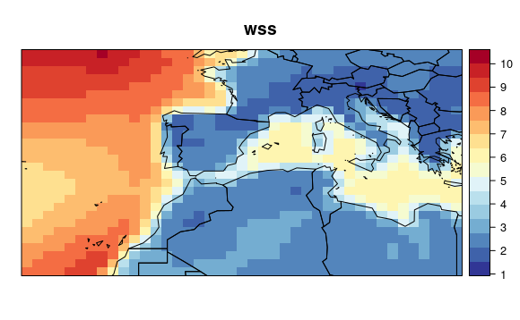 

### Fix dates 

Similarly to the UERRA data, dates from the CMIP5 files match the actual year and month, but are interpreted as the central date of the month, rather than the whole range of data. Again, the `modifyDates` function from the `dsclim` package modify the dates and fix helps to fix this small issue.

```{r correct_cmip_dates}
cmip.tasmax <- modifyDates(cmip.tasmax)
cmip.tasmin <- modifyDates(cmip.tasmin)
cmip.tas <- modifyDates(cmip.tas)
cmip.pr <- modifyDates(cmip.pr)
cmip.hurs <- modifyDates(cmip.hurs)
cmip.cld <- modifyDates(cmip.cld)
cmip.wss <- modifyDates(cmip.wss)
```
