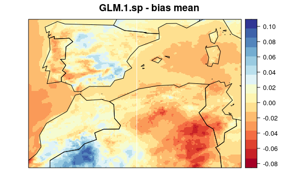
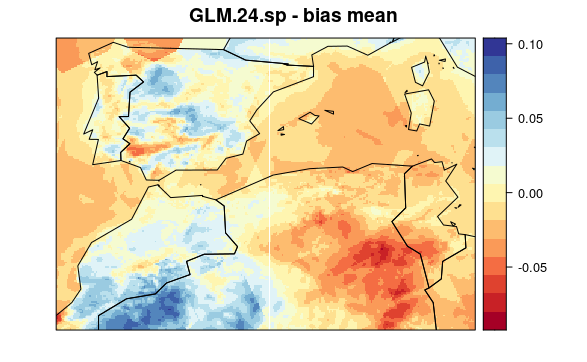
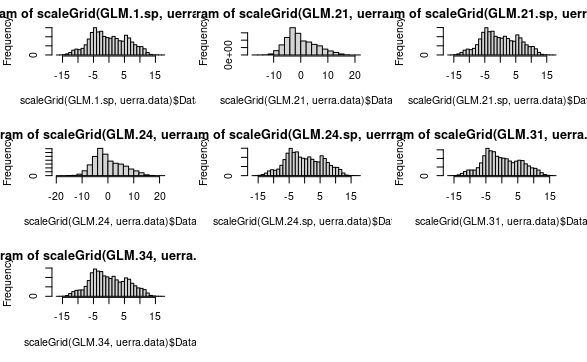

```{r global_options, include=FALSE}
library(knitr)
opts_chunk$set(echo=TRUE, warning=FALSE, message=FALSE, eval = FALSE)
```

This file is to document the downscaling process of Trace-21ka paleoclimate data using the most updated and finer resolution "historical" climate data for the Western Mediterranean region and the methods and tools implemented in the `climate4R` framework.

## Downscaling

### Defining variables and folds for crossvalidation
```{r defining_predictos_and_folds}
library(dsclim)

vars <- c("tas", "tasmax", "tasmin", "hurs@992.5561", "ps",
          "pr", "cld", "wss")

folds <- list(1961:1965, 1966:1970, 1971:1975, 1976:1980, 1981:1985, 1986:1990)
```


### Defining parameters for downscaling

```{r defining_ds_parameters}
library(downscaleR)

spatial.pars <- list(which.combine = vars,
                        v.exp = .95,
                        rot = FALSE)

scaling.pars <- list(type = "standardize",
                     spatial.frame = "field")

local.pars.M21 <- list(n = 1, vars = "tasmin")

local.pars.M24 <- list(n = 4, vars = "tasmin")

local.pars.M31 <- list(n = 1, vars = vars)

local.pars.M34 <- list(n = 4, vars = vars)

```

### Data loading

```{r load_trace_data}
trace.file.names <- traceFileNames("Data/TraCE21ka/")
hist.trace <- dsclim::loadHistoricalTraceGrids(trace.file.names)
hist.trace$Variable$varName
head(hist.trace$Dates[[1]]$start)
tail(hist.trace$Dates[[1]]$start)
head(hist.trace$Dates[[1]]$end)
tail(hist.trace$Dates[[1]]$end)
```

```{r load_uerra_data} 
uerra.tasmin = loadUerra("Data/UERRA/UERRA-HARMONIE/2m_temperature/latlon/1961-90_2m_tmin.nc", "tasmin")
uerra.tasmin$Variable$varName
head(uerra.tasmin$Dates$start)
head(uerra.tasmin$Dates$end)
tail(uerra.tasmin$Dates$end)
tail(uerra.tasmin$Dates$end)
```

### Downscaling {.tabset .tabset-pills} 

Select a model

#### GLM.1.sp 
```{r fit_GLM.1.sp}
GLM.1.sp <- downscaleR::downscaleCV(x = hist.trace,
                                   y = uerra.tasmin,
                                   method = "GLM",
                                   family = gaussian(link="identity"),
                                   folds = folds,
                                   prepareData.args = list(
                                     global.vars = NULL,
                                     local.predictors = NULL,
                                     spatial.predictors = spatial.pars,
                                     combined.only = TRUE))

visualizeR::spatialPlot(transformeR::climatology(GLM.1.sp))
```


#### GLM.21 
```{r fit_GLM.21}
GLM.21 <- downscaleR::downscaleCV(x = hist.trace,
                    y = uerra.tasmin,
                    method = "GLM",
                    family = gaussian(link="identity"),
                    folds = folds,
                    prepareData.args = list(
                      global.vars = NULL,
                      local.predictors = local.pars.M21,
                      spatial.predictors = NULL))

visualizeR::spatialPlot(transformeR::climatology(GLM.21))
```


#### GLM.21.sp 
```{r fit_GLM.21.sp}
GLM.21.sp <- downscaleR::downscaleCV(x = hist.trace,
                                    y = uerra.tasmin,
                                    method = "GLM",
                                    family = gaussian(link="identity"),
                                    folds = folds,
                                    prepareData.args = list(
                                      global.vars = NULL,
                                      local.predictors = local.pars.M21,
                                      spatial.predictors = spatial.pars,
                                      combined.only=TRUE))

visualizeR::spatialPlot(transformeR::climatology(GLM.21.sp))
```


#### GLM.24 
```{r fit_GLM.24}
GLM.24 <- downscaleR::downscaleCV(x = hist.trace,
                    y = uerra.tasmin,
                    method = "GLM",
                    family = gaussian(link="identity"),
                    folds = folds,
                    prepareData.args = list(
                      global.vars = NULL,
                      local.predictors = local.pars.M24,
                      spatial.predictors = NULL))

visualizeR::spatialPlot(transformeR::climatology(GLM.24))
```

 


#### GLM.24.sp 
```{r fit_GLM.24.sp}
GLM.24.sp <- downscaleR::downscaleCV(x = hist.trace,
                    y = uerra.tasmin,
                    method = "GLM",
                    family = gaussian(link="identity"),
                    folds = folds,
                    prepareData.args = list(
                      global.vars = NULL,
                      local.predictors = local.pars.M24,
                      spatial.predictors = spatial.pars))

visualizeR::spatialPlot(transformeR::climatology(GLM.24.sp))
```


#### GLM.31 
```{r fit_GLM.31}
GLM.31 <- downscaleR::downscaleCV(x = hist.trace,
                    y = uerra.tasmin,
                    method = "GLM",
                    family = gaussian(link="identity"),
                    folds = folds,
                    prepareData.args = list(
                      global.vars = NULL,
                      local.predictors = local.pars.M31,
                      spatial.predictors = NULL))

visualizeR::spatialPlot(transformeR::climatology(GLM.31))
```


#### GLM.34 
```{r fit_GLM.34}
GLM.34 <- downscaleR::downscaleCV(x = hist.trace,
                    y = uerra.tasmin,
                    method = "GLM",
                    family = gaussian(link="identity"),
                    folds = folds,
                    prepareData.args = list(
                      global.vars = NULL,
                      local.predictors = local.pars.M34,
                      spatial.predictors = NULL))

visualizeR::spatialPlot(transformeR::climatology(GLM.34))
```


## Evaluate downscaling performance

### Create function to extract info

```{r function_for_accuracy_metrics}
ds_validation <- function(models, obs, measure.code = "bias", index.code) {
  l <- lapply(1:length(models),
                          function(i) {
                suppressMessages(
                  climate4R.value::valueMeasure(
                    obs,
                    x = get(models[i]),
                    measure.code = measure.code,
                    index.code = index.code)$Measure)
              })
  names(l) <- models
  return(l)
}
```


## Run evaluation

```{r calculate_accuracy_metrics}
ds.methods <- c("GLM.1.sp", "GLM.21", "GLM.21.sp", "GLM.24", "GLM.24.sp", "GLM.31", "GLM.34")

value.indices <- c("Mean", "sd", "Skewness")

library(parallel)

cl <- makeCluster(detectCores())

clusterExport(cl, c("ds_validation", ds.methods, "uerra.tasmin", "value.indices"))

val.results <- parLapply(cl,
                         value.indices,
                         function(i, j, k, l){
                           ds_validation(models = j,
                                         obs = k,
                                         measure.code = l, 
                                         index.code = i)},
                         ds.methods,
                         uerra.tasmin,
                         "bias")

stopCluster(cl)

names(val.results) <- value.indices
```

## Plot evaluations' results

### Error (or bias) maps {.tabset  .tabset-pills} 

Select a model

#### GLM.1.sp
```{r map_biasses_glm1sp}
visualizeR::spatialPlot(val.results[[1]][[1]],
            backdrop.theme = "countries",
            main = "GLM.1.sp - bias mean")
```




#### GLM.21
```{r map_biasses_glm21}
visualizeR::spatialPlot(val.results[[1]][[2]],
            backdrop.theme = "countries",
            main = "GLM.21 - bias mean")
```


#### GLM.21.sp
```{r map_biasses_glm21sp}
visualizeR::spatialPlot(val.results[[1]][[3]],
            backdrop.theme = "countries",
            main = "GLM.21.sp - bias mean")
```


#### GLM.24
```{r map_biasses_glm24}
visualizeR::spatialPlot(val.results[[1]][[4]],
            backdrop.theme = "countries",
            main = "GLM.24 - bias mean")
```


#### GLM.24.sp
```{r map_biasses_glm24sp}
visualizeR::spatialPlot(val.results[[1]][[5]],
            backdrop.theme = "countries",
            main = "GLM.24.sp - bias mean")
```



#### GLM.31
```{r map_biasses_glm31}
visualizeR::spatialPlot(val.results[[1]][[6]],
            backdrop.theme = "countries",
            main = "GLM.31 - bias mean")
```


#### GLM.34
```{r map_biasses_glm34}
visualizeR::spatialPlot(val.results[[1]][[7]],
            backdrop.theme = "countries",
            main = "GLM.34 - bias mean")
```


### Violin plots sumarizing results

```{r plot_results}
library(reshape2)
library(ggplot2)
getGridData <- function(grid)grid$Data

test <- lapply(val.results, FUN=function(x)lapply(x, getGridData))

test <- melt(test)

test$mean <- ave(test$value, as.factor(test$L1), as.factor(test$L2), FUN=mean)

test$L2 <- factor(test$L2, levels = ds.methods)
test$L1 <- factor(test$L1, levels = value.indices)

ggplot(test, aes(x=L2, y=value)) + 
  geom_violin(aes(fill=mean)) +
  facet_grid(L1~., scales="free") 
```


### Error or bias histograms  

```{r plot_residual_hist}
par(mfrow=c(3,3))
hist(scaleGrid(GLM.1.sp, uerra.tasmin)$Data)
hist(scaleGrid(GLM.21, uerra.tasmin)$Data)
hist(scaleGrid(GLM.21.sp, uerra.tasmin)$Data)
hist(scaleGrid(GLM.24, uerra.tasmin)$Data)
hist(scaleGrid(GLM.24.sp, uerra.tasmin)$Data)
hist(scaleGrid(GLM.31, uerra.tasmin)$Data)
hist(scaleGrid(GLM.34, uerra.tasmin)$Data)
```

