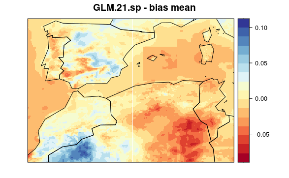

```{r, include=FALSE}
knitr::opts_chunk$set(echo = TRUE, warning = FALSE, message = FALSE, eval = FALSE)
```

Here, we document the downscaling process with crossvalidation of Trace-21ka paleoclimate data using the UERRA dataset for the historical period. This evaluation allows us to test several configurations of the downscaling process and select the optimal ones to run the downscaling of the whole dataset.

More information can be found [here](https://github.com/SantanderMetGroup/notebooks/blob/master/2019_downscaleR_GMD.pdf), [here](https://github.com/SantanderMetGroup/notebooks), and [here](https://github.com/SantanderMetGroup/downscaleR/wiki).


## Downscaling

The downscaling process will be divided in several steps.

### Defining variables and folds for crossvalidation

Let start by loading the R package `dsclim`. Then, we create a vector (`vars`) containing the names of several climate variables to be used as predictors in the downscaling process. The variable `local.var` is assigned the value "tasmin", which is the variable that we aim to downscale in the first place. The next line creates a list of six elements containing the years 1961 to 1990 split into five-year groups, this is where we are defining the years to be used in the crossvalidation. To do so, we will fit one downscaling model for each of the five years period using data from the rest of the years and using this period to evaluate/validate the model. Hence, we will fit six models. Finally, the `trace.dir` variable is set to the path of a directory containing TraCE21ka data.

```{r defining_predictos_and_folds}
library(dsclim)

vars <- c(
  "tas", "tasmax", "tasmin", "hurs@992.5561", "ps",
  "pr", "cld", "wss"
)

local.var <- "tasmin"

folds <- list(1961:1965, 1966:1970, 1971:1975, 1976:1980, 1981:1985, 1986:1990)

trace.dir <- "../../Data/TraCE21ka/"
```


### Defining parameters for downscaling

The following code is setting up parameters for the R package `downscaleR`. The `spatial.pars` list is defining the variables that should be combined using a Principal Component Analysis. Here, we specify all predictor variables. Hence, those models using spatial.pars argument will use all the variables to fit a PCA and transform the varibles. More especifically, the PCA will retain those axis that explain up to 90% of the variance (`v.exp`) and will not be rotated. The ` local.pars.XXX` objects define different configurations of local vars for the models. `M2` models use the only one variable as the local variable, whereas `M3` uses all predictor variables as local variables. Finally, models ending in 1 use the information of the local pixel as predictor, whereas models ending in 4 use the information from the 4 closest pixels as predictors.

```{r defining_ds_parameters}
library(downscaleR)

spatial.pars <- list(
  which.combine = vars,
  v.exp = .95,
  rot = FALSE
)

local.pars.M21 <- list(n = 1, vars = local.var)

local.pars.M24 <- list(n = 4, vars = local.var)

local.pars.M31 <- list(n = 1, vars = vars)

local.pars.M34 <- list(n = 4, vars = vars)
```


### Data loading

To load the data, we retrieve file names from all files in the trace directory. The first line assigns the trace file names from the trace directory to the variable "trace.file.names". Then, we loads the trace files into the variable "hist.trace" and specifies the years 1961-1990, since we are not intended to downscale the whole period but only the historical period to run the crossvalidation. The following lines check that the data were loaded properly.

```{r load_trace_data}
trace.file.names <- traceFileNames(trace.dir)
hist.trace <- dsclim::loadTrace(trace.file.names, years = 1961:1990)
hist.trace$Variable$varName
head(hist.trace$Dates[[1]]$start)
tail(hist.trace$Dates[[1]]$start)
head(hist.trace$Dates[[1]]$end)
tail(hist.trace$Dates[[1]]$end)
```

Now, we need to load the data from the UERRA project since this is going to be our current high resolution climate data to be used as predictand. The first line is loading the local variable (`local.var`) from the `2m_temperature/latlon/1961-90_2m_tmin.nc` file in the UERRA-HARMONIE directory and and assigning it to the variable `uerra.data`. The following lines just check that data were loaded properly and matches the same dates than loaded TraCE21ka data.

```{r load_uerra_data} 
uerra.data <- loadUerra("../../Data/UERRA/UERRA-HARMONIE/2m_temperature/latlon/1961-90_2m_tmin.nc", local.var)
uerra.data$Variable$varName
head(uerra.data$Dates$start)
head(uerra.data$Dates$end)
tail(uerra.data$Dates$end)
tail(uerra.data$Dates$end)
```


### Downscaling {.tabset .tabset-pills} 

Now, we can start fitting models with the cross validation approach.

In general, the code uses the `downscaleR` package to fit a Generalized Linear Model (GLM) downscaling method to create a model that predicts paleoclimate data from historical climate. The `family` argument sets the distribution of the model to a Gaussian distribution with an `identity` link. The `folds` argument sets the number of folds to use in the cross-validation. The `prepareData.args` is a list of arguments that sets the global, local, and spatial predictors to use in the model. 

The result from the downscaling is a high resolution dataset for the whole period (1961-1990), although the data for group of five years were not used to fit the particular model used to dowscale this five years data. Finally, we use the `spatialPlot` function from the `visualizeR` package to plot an average of the output (e.g. a `climatology` calculated with the `transformeR` package).

To see the code for each model, select a tab:

#### GLM.1.sp 

This model uses spatial pars but do not use global or local variables.

```{r fit_GLM.1.sp}
GLM.1.sp <- downscaleR::downscaleCV(
  x = hist.trace,
  y = uerra.data,
  method = "GLM",
  family = gaussian(link = "identity"),
  folds = folds,
  prepareData.args = list(
    global.vars = NULL,
    local.predictors = NULL,
    spatial.predictors = spatial.pars,
    combined.only = TRUE
  )
)

visualizeR::spatialPlot(transformeR::climatology(GLM.1.sp))
```


#### GLM.21 

This model uses a local variables with 1 local pixel, but no spatial or global variables.

```{r fit_GLM.21}
GLM.21 <- downscaleR::downscaleCV(
  x = hist.trace,
  y = uerra.data,
  method = "GLM",
  family = gaussian(link = "identity"),
  folds = folds,
  prepareData.args = list(
    global.vars = NULL,
    local.predictors = local.pars.M21,
    spatial.predictors = NULL
  )
)

visualizeR::spatialPlot(transformeR::climatology(GLM.21))
```


#### GLM.21.sp 

This model uses a local variables with 1 local pixel and spatial variables, but no global variables.

```{r fit_GLM.21.sp}
GLM.21.sp <- downscaleR::downscaleCV(
  x = hist.trace,
  y = uerra.data,
  method = "GLM",
  family = gaussian(link = "identity"),
  folds = folds,
  prepareData.args = list(
    global.vars = NULL,
    local.predictors = local.pars.M21,
    spatial.predictors = spatial.pars,
    combined.only = TRUE
  )
)

visualizeR::spatialPlot(transformeR::climatology(GLM.21.sp))
```


#### GLM.24 

This model uses a local variables with 4 local pixel, but no spatial or global variables.

```{r fit_GLM.24}
GLM.24 <- downscaleR::downscaleCV(
  x = hist.trace,
  y = uerra.data,
  method = "GLM",
  family = gaussian(link = "identity"),
  folds = folds,
  prepareData.args = list(
    global.vars = NULL,
    local.predictors = local.pars.M24,
    spatial.predictors = NULL
  )
)

visualizeR::spatialPlot(transformeR::climatology(GLM.24))
```

 


#### GLM.24.sp 

This model uses a local variables with 4 local pixel and spatial variables, but no global variables.

```{r fit_GLM.24.sp}
GLM.24.sp <- downscaleR::downscaleCV(
  x = hist.trace,
  y = uerra.data,
  method = "GLM",
  family = gaussian(link = "identity"),
  folds = folds,
  prepareData.args = list(
    global.vars = NULL,
    local.predictors = local.pars.M24,
    spatial.predictors = spatial.pars
  )
)

visualizeR::spatialPlot(transformeR::climatology(GLM.24.sp))
```


#### GLM.31 

This model uses all variables as local variables with 1 local pixel, but no spatial or global variables.

```{r fit_GLM.31}
GLM.31 <- downscaleR::downscaleCV(
  x = hist.trace,
  y = uerra.data,
  method = "GLM",
  family = gaussian(link = "identity"),
  folds = folds,
  prepareData.args = list(
    global.vars = NULL,
    local.predictors = local.pars.M31,
    spatial.predictors = NULL
  )
)

visualizeR::spatialPlot(transformeR::climatology(GLM.31))
```


#### GLM.34 

This model uses all variables as local variables with 4 local pixel, but no spatial or global variables.

```{r fit_GLM.34}
GLM.34 <- downscaleR::downscaleCV(
  x = hist.trace,
  y = uerra.data,
  method = "GLM",
  family = gaussian(link = "identity"),
  folds = folds,
  prepareData.args = list(
    global.vars = NULL,
    local.predictors = local.pars.M34,
    spatial.predictors = NULL
  )
)

visualizeR::spatialPlot(transformeR::climatology(GLM.34))
```


## Evaluate downscaling performance

Now that we have a downscaled version of the data, we can evaluate their values against the "real" data, represented here by the UERRA dataset.

### Create function to extract info

First, we define a function that will run the evaluation and extract significant metrics.

```{r function_for_accuracy_metrics}
ds_validation <- function(models, obs, measure.code = "bias", index.code) {
  l <- lapply(
    1:length(models),
    function(i) {
      suppressMessages(
        climate4R.value::valueMeasure(
          obs,
          x = get(models[i]),
          measure.code = measure.code,
          index.code = index.code
        )$Measure
      )
    }
  )
  names(l) <- models
  return(l)
}
```


### Run evaluation

Then, we can use this function to evaluate all the models. To speed things up, we run this code in several cores of the computer using the `parallel` package.

```{r calculate_accuracy_metrics}
ds.methods <- c("GLM.1.sp", "GLM.21", "GLM.21.sp", "GLM.24", "GLM.24.sp", "GLM.31", "GLM.34")

value.indices <- c("Mean", "sd", "Skewness")

library(parallel)

cl <- makeCluster(detectCores())

clusterExport(cl, c("ds_validation", ds.methods, "uerra.data", "value.indices"))

val.results <- parLapply(
  cl,
  value.indices,
  function(i, j, k, l) {
    ds_validation(
      models = j,
      obs = k,
      measure.code = l,
      index.code = i
    )
  },
  ds.methods,
  uerra.data,
  "bias"
)

stopCluster(cl)

names(val.results) <- value.indices
```


## Plot evaluations' results

Finally, we can plot the results from the evaluations in several formats.

### Error (or bias) maps {.tabset  .tabset-pills}

First, we plot mean bias in each pixel (the mean include 30 years * 12 months data). To see the maps from each model select a tab:

#### GLM.1.sp
```{r map_biasses_glm1sp}
visualizeR::spatialPlot(val.results[[1]][[1]],
  backdrop.theme = "countries",
  main = "GLM.1.sp - bias mean"
)
```


#### GLM.21
```{r map_biasses_glm21}
visualizeR::spatialPlot(val.results[[1]][[2]],
  backdrop.theme = "countries",
  main = "GLM.21 - bias mean"
)
```


#### GLM.21.sp

```{r map_biasses_glm21sp}
visualizeR::spatialPlot(val.results[[1]][[3]],
  backdrop.theme = "countries",
  main = "GLM.21.sp - bias mean"
)
```




#### GLM.24

```{r map_biasses_glm24}
visualizeR::spatialPlot(val.results[[1]][[4]],
  backdrop.theme = "countries",
  main = "GLM.24 - bias mean"
)
```


#### GLM.24.sp

```{r map_biasses_glm24sp}
visualizeR::spatialPlot(val.results[[1]][[5]],
  backdrop.theme = "countries",
  main = "GLM.24.sp - bias mean"
)
```


#### GLM.31

```{r map_biasses_glm31}
visualizeR::spatialPlot(val.results[[1]][[6]],
  backdrop.theme = "countries",
  main = "GLM.31 - bias mean"
)
```


#### GLM.34

```{r map_biasses_glm34}
visualizeR::spatialPlot(val.results[[1]][[7]],
  backdrop.theme = "countries",
  main = "GLM.34 - bias mean"
)
```


### Violin plots sumarizing results

To have an overall perspective of all the metrics from the different models, we can use violin plots for each model and the three metrics of the bias (mean, sd, and skewness).

```{r plot_results}
library(reshape2)
library(ggplot2)
getGridData <- function(grid) grid$Data

test <- lapply(val.results, FUN = function(x) lapply(x, getGridData))

test <- melt(test)

test$mean <- ave(test$value, as.factor(test$L1), as.factor(test$L2), FUN = mean)

test$L2 <- factor(test$L2, levels = ds.methods)
test$L1 <- factor(test$L1, levels = value.indices)

ggplot(test, aes(x = L2, y = value)) +
  geom_violin(aes(fill = mean)) +
  facet_grid(L1 ~ ., scales = "free")
```


### Error or bias histograms

Finally, we complement previous evaluations ploting the histograms from each metric.

```{r plot_residual_hist, out.width=500}
library(transformeR)
par(mfrow = c(3, 3))
hist(scaleGrid(GLM.1.sp, uerra.data)$Data)
hist(scaleGrid(GLM.21, uerra.data)$Data)
hist(scaleGrid(GLM.21.sp, uerra.data)$Data)
hist(scaleGrid(GLM.24, uerra.data)$Data)
hist(scaleGrid(GLM.24.sp, uerra.data)$Data)
hist(scaleGrid(GLM.31, uerra.data)$Data)
hist(scaleGrid(GLM.34, uerra.data)$Data)
```

{height=500 width=500} 


